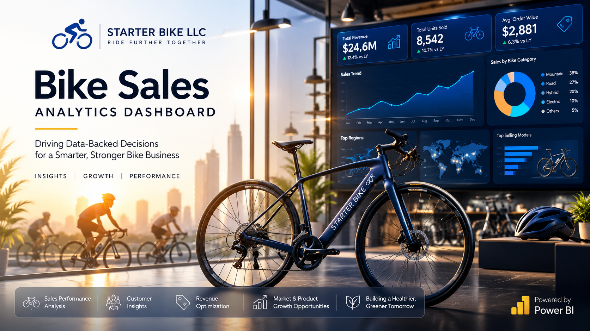
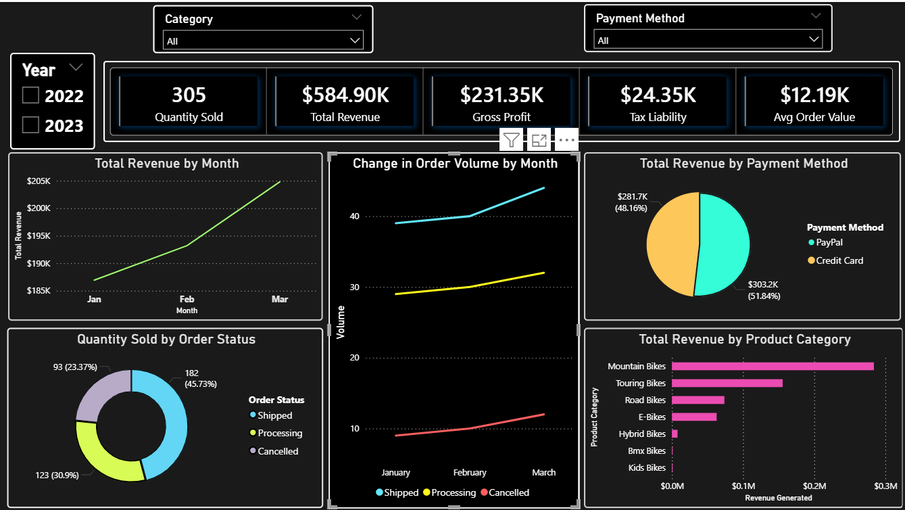
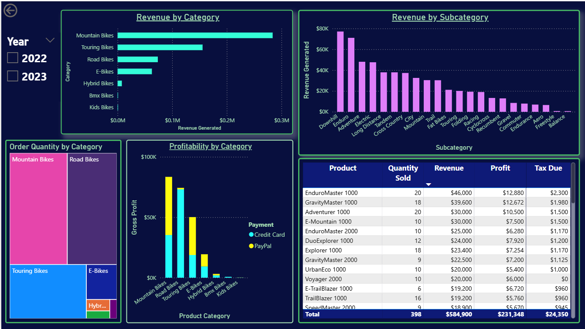
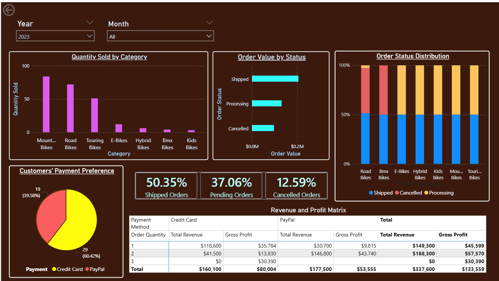
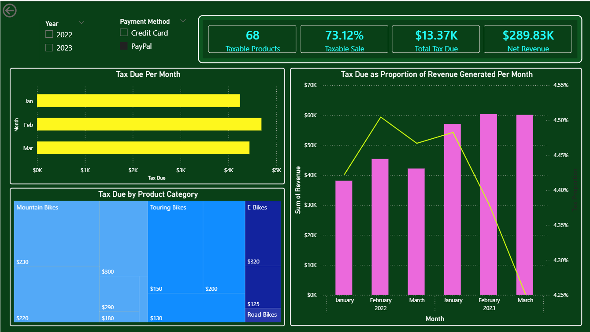

<h1 align = "center"> 
Starter Bike LLC Sales Analytics  
Dashboard
</h1>

## Background

In the quest to understand Q1 sales performance and trends, Starter Bike LLC, a fictional bicycle retailer, is looking to obtain insights from its Q1 operations over the past years. Company executives believe that data from the 2022 and 2023 Q1 sales can provide some critical insights into how the company performs during the first quarter of each financial year. They believe that, with proper analytics, the company can efficiently track essential performance indicators, including, but not limited to, product performance, profitability, tax liabilities, and operational efficiency, which can then inspire the company to optimize sales operations and improve revenue generation. 

The 2022 and 2023 Q1 sales operation data has been successfully consolidated and readily available. However, despite having operational data readily available, the management still lacks a centralized reporting solution that transforms this raw information into meaningful business insights.

In seeking a working solution, company executives have asked for an analytical dashboard that will aid in decision-making by cutting the time decision-makers would spend compiling reports manually. The underlying need is to make it simpler to identify revenue drivers, evaluate product performance, monitor operational efficiency, and estimate tax obligations. 

The executives forsee that as the business is destined to scale, manual reporting will soon become increasingly inefficient particularly since it's prone to error.

### Project Objective

This project aims to transform the company's transactional sales data into an interactive Business Intelligence solution using Microsoft Power BI.

### Repository Structure

Below is the structure proposed as ideal for representing the data analysis process, from transforming the raw data to developing the final dashboard. This is an equivalent of the structure that the project reports are stored in github repository for reproducibility.

    Bike-Sales-PowerBI-Project/

    │
    ├── 01 Project Charter/
    │   └── project_charter.md
    │
    ├── 02 Business Requirements/
    │   └── business_requirement_document.pdf
    │
    ├── 03 Documentation/
    │   ├── Business Questions.md
    │   ├── Data Cleaning Report.md
    │   ├── Data Dictionary.md
    │   └── Insights.md
    │
    ├── 04 Data/
    │   └── data_audit/
    │       ├── data_audit_report.md
    │       ├── data_profile_summary.pdf
    │       └── data_quality_checklist.md
    │  
    │   ├── processed/
    │   └── raw/
    │       └── Quarter-One-Report-Workbook.xlsx
    │
    ├── 05 Reports/
    │   ├── Bike Sales Dashboard.pbix
    │   └── 
    │
    ├── 06 Power Query/
    │
    ├── 07 DAX/
    │   ├── Calculations.md
    │   └── Measures.md
    │
    ├── 08 Images/
    │
    ├── LICENSE
    │
    └── README.md

## Business Problem

Starter Bike LLC, has generated sales every day but lacks visibility into its overall business performance.

Company executives say it still takes effort to answer critical operational questions such as:

- Which products contribute the most to revenue?
- Which product categories are the most profitable?
- How much tax liability does the business incur?
- Which products trigger the highest tax expense?
- How are sales changing over time?
- Which orders are successfully completed versus cancelled?
- Where are operational inefficiencies occurring?

Without these insights, company executives believe there is a relatively substantial risk of making decisions based on assumptions rather than evidence.

## Project Goal

As the assigned analyst, the goal of this project is to design and develop an interactive Power BI dashboard that can enable Starter Bike LLC executives to monitor sales performance, product performance, operational efficiency, and tax obligations to support evidence-based business decision-making.

The dashboard is, therefore, intended to enable management to monitor:

### Sales Performance
- Total revenue generated.
- Sales trends over time.
- Order value.
- Order volumes.

### Product Performance
- Top-performing products.
- Similarities and differences in product categories.
- Product profitability.
- Product contribution to total revenue.

### Operational Performance
- Order status distribution.
- Risk of order cancellation.
- Operational efficiency.
- Products with high risk of cancellation.

### Tax Analysis
- Tax liability.
- Tax contribution by product and category.

### Executive Reporting

Provide an interactive dashboard allowing executives to filter results by:

- Year, Month or Date
- Product Category
- Order Status

## Power BI Report Interface

<h2 align = "center"> 
Page 1: Executive Overview
</h2>

Reports on:

    The number of bikes sold,   Total revenue,    Gross profit,    Tax liability,    
    Total revenue by month, Quantity sold by order status,      Change in order volume, 
    Total revenue by payment method,  Total revenue by product category.

<h2 align = "center"> 
Page 2: Product Performance
</h2>

Reports on:

    Revenue generated by product category, 
    Revenue generated by subcategory,
    Order quantity by category,
    Profitability by category

<h2 align = "center"> 
Page 3: Operational Performance
</h2>

Reports on:

    Quantity of bikes sold by category,
    Order Value for all three order status,
    Distribution of order status,
    Customers' payment preference,

<h2 align = "center"> 
Page 4: Tax_Obligation
</h2>

Reports on:

    Taxable products, Taxable sale, Tax due, Net Revenue,
    Tax due by moth, Tax due by product category,
    Tax due as a proportion of revenue generated

